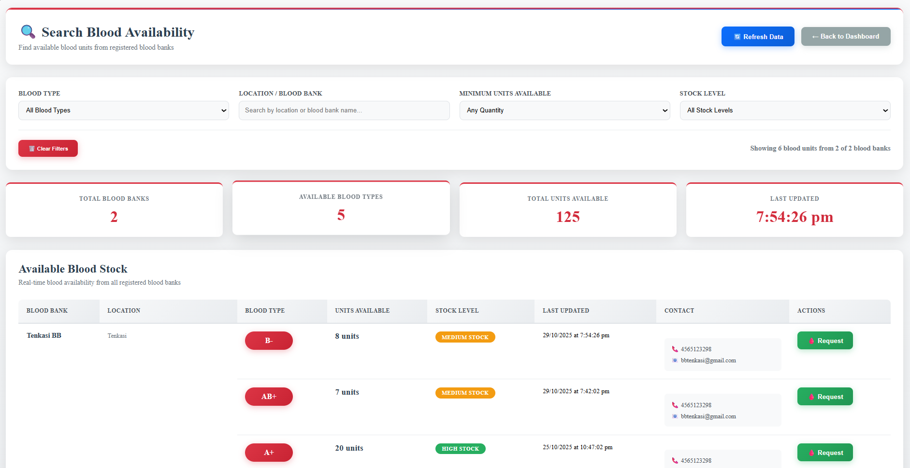

# 🩸 Blood Bank Management System

A comprehensive web application for managing blood bank operations, connecting donors, blood banks, and hospitals in real-time.

## 📋 Table of Contents
- [Features](#features)
- [Tech Stack](#tech-stack)
- [Installation](#installation)
- [Running the Application](#running-the-application)
- [Usage Guide](#usage-guide)
- [API Endpoints](#api-endpoints)
- [Upcoming Features](#upcoming-features)
- [Troubleshooting](#troubleshooting)

## ✨ Features

### 🔐 Authentication & Registration
- **Multi-role registration** (Donor, Hospital, Blood Bank)
- **Secure login** with session management
- **Role-based dashboard access**

### 🏥 Blood Bank Dashboard
- **Inventory Management**: Add/update blood stock levels
- **Blood Requests**: Post requests for specific blood types from donors
- **Application Management**: Review and approve/reject donor applications
- **Hospital Requests**: Manage blood requests from hospitals
- **Real-time Stock Tracking**

### 🩺 Hospital Dashboard
- **Blood Availability Search**: View real-time stock from all blood banks
- **Blood Request System**: Submit requests to specific blood banks
- **Request History**: Track request status (Pending/Approved/Rejected)
- **Contact Management**: Direct access to blood bank contacts

### ❤️ Donor Dashboard
- **Blood Request Browser**: View active blood requests from blood banks
- **Application System**: Apply to donate for compatible blood types
- **Application History**: Track donation application status
- **Blood Bank Directory**: Find nearby blood banks

### 🔍 Public Features
- **Blood Search Dashboard**: Public access to blood availability
- **Blood Compatibility Chart**: Educational resource
- **Emergency Information**: Quick access for urgent needs

  ## 📸 Screenshots

### Dashboard Overview


*Main dashboard showing blood availability and quick actions*

### Blood Search

*Advanced blood search with filters and real-time availability*

### Donor Application

*Donor application interface with blood type compatibility*

### Hospital Request

*Hospital blood request form with urgency levels*

### Blood Bank Management


*Blood bank dashboard for inventory and request management*

## 🛠 Tech Stack

### Frontend
- **React.js** - UI framework
- **React Router** - Navigation
- **CSS3** - Styling and responsive design

### Backend
- **Node.js** - Runtime environment
- **Express.js** - Web framework
- **MongoDB** - Database
- **Mongoose** - ODM

### Development Tools
- **Create React App** - Frontend boilerplate
- **Nodemon** - Development server
- **CORS** - Cross-origin requests

## 🚀 Installation

### Prerequisites
- Node.js (v14 or higher)
- MongoDB (local or Atlas)
- npm or yarn

### Step 1: Clone the Repository
```bash
git clone <repository-url>
cd blood-bank-management
```

### Step 2: Backend Setup
```bash
# Navigate to backend directory
cd backend

# Install dependencies
npm install

# Create environment file
echo "PORT=5000
MONGO_URI=mongodb://localhost:27017/blood_management
JWT_SECRET=your_jwt_secret_here" > .env
```

### Step 3: Frontend Setup
```bash
# Navigate to frontend directory (from root)
cd frontend

# Install dependencies
npm install
```

## 🏃 Running the Application

### Step 1: Start MongoDB
```bash
# If using local MongoDB
mongod

# Or use MongoDB Atlas (cloud) - no local setup needed
```

### Step 2: Start Backend Server
```bash
# From backend directory
cd backend
npm start

# Server runs on http://localhost:5000
```

### Step 3: Start Frontend Development Server
```bash
# From frontend directory  
cd frontend
npm start

# Application runs on http://localhost:3000
```

## 📖 Usage Guide

### For Blood Banks
1. **Register/Login** as a Blood Bank
2. **Add Blood Stock** in Inventory section
3. **Post Blood Requests** when specific types are needed
4. **Manage Applications** from donors and hospitals
5. **Update Stock** when blood is collected or used

### For Hospitals
1. **Register/Login** as a Hospital
2. **Search Blood Availability** across all blood banks
3. **Submit Blood Requests** to specific blood banks
4. **Track Request Status** in request history
5. **Contact Blood Banks** directly for emergencies

### For Donors
1. **Register/Login** as a Donor
2. **Browse Blood Requests** from blood banks
3. **Apply to Donate** for compatible blood types
4. **Track Application Status**
5. **Find Blood Banks** in directory

### For Public Users
1. **Use Blood Search** without login
2. **View Blood Compatibility** chart
3. **Access Emergency** contact information

## 🌐 API Endpoints

### Authentication
- `POST /api/bloodbank/register` - Blood bank registration
- `POST /api/bloodbank/login` - Blood bank login
- `POST /api/hospital/register` - Hospital registration  
- `POST /api/hospital/login` - Hospital login
- `POST /api/donor/register` - Donor registration
- `POST /api/donor/login` - Donor login

### Blood Stock Management
- `GET /api/stock` - Get all blood stock
- `GET /api/stock/:bankId` - Get stock by blood bank
- `POST /api/stock` - Add/update stock

### Blood Requests
- `GET /api/blood-requests/active` - Get active blood requests
- `POST /api/blood-requests` - Create blood request
- `PUT /api/blood-requests/:id` - Update blood request

### Hospital Requests
- `POST /api/hospital-requests` - Submit hospital request
- `GET /api/hospital-requests/hospital/:id` - Get hospital requests
- `PATCH /api/hospital-requests/:id/status` - Update request status

### Donation Applications
- `POST /api/donation-applications` - Submit donation application
- `GET /api/donation-applications/donor/:id` - Get donor applications
- `PATCH /api/donation-applications/:id/status` - Update application status

## 🚀 Upcoming Features

### 🔔 Alert & Notification System
- **Real-time notifications** when blood stock reaches critical levels
- **Email/SMS alerts** for urgent blood requirements
- **Push notifications** for mobile users
- **Automated reminder** system for blood banks

### 🏥 Enhanced Hospital Features
- **Urgent blood requirement** flags with priority handling
- **Emergency broadcast** to multiple blood banks simultaneously
- **Blood requirement matching** with donor databases
- **Scheduled pickup** and delivery coordination

### 📍 Location-Based Services
- **GPS integration** for nearby blood bank detection
- **Distance calculation** and travel time estimates
- **Map visualization** of blood banks with stock levels
- **Regional blood availability** heat maps

### 📱 Mobile Application
- **React Native mobile app** for on-the-go access
- **Offline functionality** for emergency situations
- **QR code integration** for quick blood bank check-ins
- **Donor loyalty** and reward programs

### 🔍 Advanced Search & Analytics
- **Predictive analytics** for blood demand forecasting
- **Seasonal trend analysis** for stock planning
- **Donor retention** and engagement metrics
- **Blood utilization** and wastage reports

### 🤖 AI-Powered Features
- **Smart matching** between donors and requirements
- **Automated stock** replenishment suggestions
- **Donor eligibility** pre-screening
- **Emergency response** coordination

## 🐛 Troubleshooting

### Common Issues

#### Connection Refused Errors
```bash
# Check if backend is running
curl http://localhost:5000/api/stock

# Check MongoDB connection
mongosh --eval "db.adminCommand('ismaster')"
```

#### CORS Errors
- Ensure backend has CORS enabled
- Check if frontend is making requests to correct port (5000)

#### Database Issues
```bash
# Reset database (development only)
mongo blood_management --eval "db.dropDatabase()"

# Check collections
mongo blood_management --eval "show collections"
```

#### Stock Not Updating
- Check browser console for API errors
- Verify MongoDB connection string in .env file
- Ensure bloodBankId is properly set in requests

### Development Tips

#### Adding New Blood Types
Update the blood type arrays in:
- BloodBankDashboard.jsx
- DonorDashboard.jsx  
- HospitalDashboard.jsx
- BloodSearchDashboard.jsx

#### Testing User Flows
1. **Register all three roles** for complete testing
2. **Create blood stock** as blood bank
3. **Submit requests** as hospital
4. **Apply to donate** as donor

## 🤝 Contributing

1. Fork the repository
2. Create feature branch (`git checkout -b feature/AmazingFeature`)
3. Commit changes (`git commit -m 'Add AmazingFeature'`)
4. Push to branch (`git push origin feature/AmazingFeature`)
5. Open Pull Request

## 📄 License

This project is licensed under the MIT License - see the [LICENSE.md](LICENSE.md) file for details.

## 🆘 Support

For support and questions:
- 📧 Email: support@bloodbank.com
- 🐛 Create an issue in GitHub repository
- 💬 Join our community Discord

---

**⭐ Remember to star this repository if you find it helpful!**

**💉 Donate Blood - Save Lives!**
